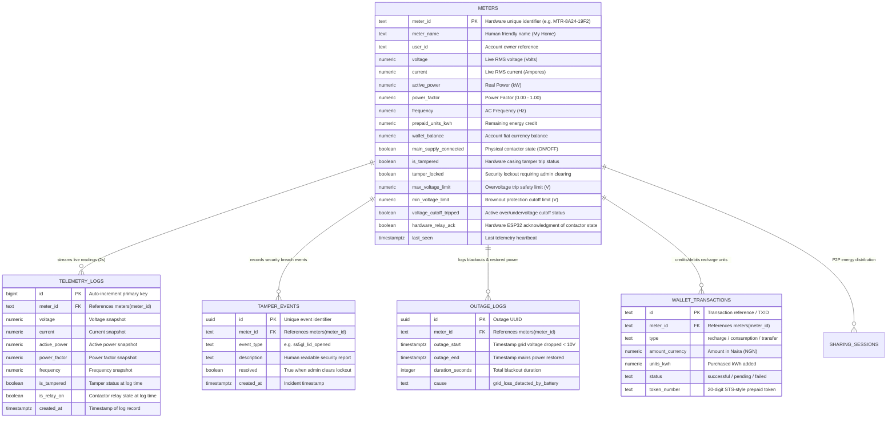

# 📊 VOLTRIX Smart Energy Meter - Complete Database Schema & Report

**Target Database**: PostgreSQL 15+ (Supabase Managed)  
**Project ID**: `kmosslvdjdhrjgvitctr`  
**Endpoint**: `https://kmosslvdjdhrjgvitctr.supabase.co`  
**Generated For**: Project Documentation, Report Copying, and Schema Architecture Reference

---

## 1. Relational Architecture & Entity Relationship Diagram (ERD)



---

## 2. Comprehensive Table Schemas

### 2.1 Table: `public.meters` (Master Hardware & Live State)
Master register storing live telemetry, protective limits, wallet balance, and relay actuation status.

| Column | Data Type | Nullable | Default | Description |
| :--- | :--- | :---: | :--- | :--- |
| `meter_id` | `text` | **NO** (PK) | *None* | Unique Hardware Serial / Identifier (e.g. `MTR-8A24-19F2`) |
| `meter_name` | `text` | **NO** | `'My Home'` | Friendly label assigned to the meter |
| `user_id` | `text` | **NO** | `'usr_9921'` | Unique user/customer identifier |
| `voltage` | `numeric` | **NO** | `230.0` | Real-time RMS Grid Voltage (V) from PZEM sensor |
| `current` | `numeric` | **NO** | `0.0` | Real-time Current (A) |
| `active_power` | `numeric` | **NO** | `0.0` | Real-time Active Power (kW) |
| `power_factor` | `numeric` | **NO** | `0.95` | AC Power Factor (0.00 to 1.00) |
| `frequency` | `numeric` | **NO** | `50.0` | Grid frequency in Hertz (Hz) |
| `apparent_power` | `numeric` | **NO** | `0.0` | Apparent power (kVA = V * A / 1000) |
| `reactive_power` | `numeric` | **NO** | `0.0` | Reactive power (kVAR) |
| `wallet_balance` | `numeric` | **NO** | `14500.0` | Fiat balance in Naira (₦) |
| `prepaid_units_kwh`| `numeric` | **NO** | `96.6` | Available prepaid electricity units (kWh) |
| `estimated_days_remaining` | `integer` | **NO** | `12` | Run-time prediction based on consumption pattern |
| `auto_topup_enabled` | `boolean` | **NO** | `true` | Automated balance replenishment switch |
| `auto_topup_threshold` | `numeric` | **NO** | `2000.0` | Minimum balance triggering top-up |
| `energy_today` | `numeric` | **NO** | `8.42` | Total accumulated energy consumed today (kWh) |
| `energy_yesterday`| `numeric` | **NO** | `9.56` | Energy consumed yesterday (kWh) |
| `energy_week` | `numeric` | **NO** | `54.8` | Energy consumed during current week (kWh) |
| `energy_month` | `numeric` | **NO** | `214.6` | Energy consumed during current month (kWh) |
| `projected_month`| `numeric` | **NO** | `246.0` | Projected monthly total (kWh) |
| `estimated_cost_today` | `numeric` | **NO** | `1263.0` | Cost in Naira incurred today (₦) |
| `estimated_bill_month` | `numeric` | **NO** | `32190.0` | Month-to-date total bill (₦) |
| `projected_bill_month` | `numeric` | **NO** | `36900.0` | End-of-month projected bill (₦) |
| `grid_status` | `text` | **NO** | `'online'` | `'online'` (Mains AC > 10V) or `'offline'` (Blackout) |
| `device_status` | `text` | **NO** | `'online'` | Microcontroller connectivity status |
| `connection_quality` | `text` | **NO** | `'good'` | Wi-Fi Signal Health indicator |
| `battery_percentage` | `integer` | **NO** | `82` | Backup Li-Ion battery fuel gauge (%) |
| `battery_status` | `text` | **NO** | `'charging'` | `'charging'` / `'discharging'` / `'full'` |
| `main_supply_connected` | `boolean` | **NO** | `true` | **Remote Contactor Command State** (`true` = ON, `false` = OFF) |
| `is_tampered` | `boolean` | **NO** | `false` | Physical SS-5GL microswitch lid state |
| `tamper_locked` | `boolean` | **NO** | `false` | Security Lockout preventing re-arming until admin clears |
| `tariff_rate` | `numeric` | **NO** | `150.0` | Billing rate per unit (₦/kWh) |
| `currency_symbol`| `text` | **NO** | `'₦'` | Currency symbol |
| `currency_code` | `text` | **NO** | `'NGN'` | Currency standard code |
| `firmware_version`| `text` | **NO** | `'v1.0.4'` | Installed firmware release string |
| `last_seen` | `timestamptz` | **NO** | `now()` | Timestamp of last received telemetry heartbeat |
| `created_at` | `timestamptz` | **NO** | `now()` | Record creation timestamp |
| `updated_at` | `timestamptz` | **NO** | `now()` | Last state modification timestamp |
| `max_voltage_limit` | `numeric` | **NO** | `250.0` | **Dynamic Overvoltage Threshold (V)** from web slider |
| `min_voltage_limit` | `numeric` | **NO** | `180.0` | **Dynamic Brownout Threshold (V)** from web slider |
| `bill_limit_threshold` | `numeric` | **NO** | `35000.0` | Monthly spending budget ceiling (₦) |
| `voltage_cutoff_tripped`| `boolean` | **NO** | `false` | True when voltage exceeded max or dropped below min |
| `bill_cutoff_tripped` | `boolean` | **NO** | `false` | True when monthly spend exceeded budget cap |
| `hardware_relay_ack` | `boolean` | YES | `true` | **Hardware Two-Way ACK** (ESP32 reporting its physical GPIO 13 status) |
| `location` | `text` | **NO** | `'Building Main'` | Installation premises description |
| `building_id` | `text` | **NO** | `'BLD-01'` | Facility/Building zone identifier |
| `over_current_limit`| `numeric` | **NO** | `30.0` | Maximum rated current capacity before overload |
| `monthly_budget_naira` | `numeric` | **NO** | `25000.0` | User budget ceiling (₦) |
| `monthly_budget_kwh` | `numeric` | **NO** | `300.0` | User budget ceiling (kWh) |
| `budget_alert_tiers` | `jsonb` | **NO** | `{"50": false, ...}` | Threshold triggers at 50%, 80%, 90%, 100% |
| `wifi_rssi` | `integer` | YES | `-68` | Received Wi-Fi signal strength (dBm) |
| `free_heap_bytes`| `integer` | YES | `185420` | Microcontroller dynamic RAM headroom |
| `uptime_seconds`| `bigint` | YES | `3600` | Seconds elapsed since last ESP32 boot |
| `battery_mv` | `integer` | YES | `3950` | Backup battery terminal voltage (mV) |

---

### 2.2 Table: `public.telemetry_logs` (High-Frequency Historical Telemetry)
Historical time-series table receiving live PZEM-004T RMS sensor data every 2 seconds.

| Column | Data Type | Nullable | Default | Description |
| :--- | :--- | :---: | :--- | :--- |
| `id` | `bigint` | **NO** (PK) | `nextval(...)` | Sequential primary key |
| `meter_id` | `text` | **NO** (FK) | *None* | References `meters(meter_id)` |
| `voltage` | `numeric` | **NO** | *None* | Grid Voltage (V) |
| `current` | `numeric` | **NO** | *None* | Current load (A) |
| `active_power` | `numeric` | **NO** | *None* | Active power draw (kW) |
| `power_factor` | `numeric` | YES | `0.95` | Power factor |
| `frequency` | `numeric` | YES | `50.0` | Grid frequency (Hz) |
| `energy_today` | `numeric` | YES | *None* | Accumulated energy at timestamp |
| `is_tampered` | `boolean` | YES | `false` | Tamper sensor flag |
| `is_relay_on` | `boolean` | YES | `true` | Contactor state |
| `created_at` | `timestamptz` | **NO** | `now()` | Log insertion timestamp |

---

### 2.3 Table: `public.tamper_events` (Security Enclosure Audit)
Audit trail of physical enclosure tampering events (SS-5GL microswitch activations).

| Column | Data Type | Nullable | Default | Description |
| :--- | :--- | :---: | :--- | :--- |
| `id` | `uuid` | **NO** (PK) | `gen_random_uuid()` | Unique event UUID |
| `meter_id` | `text` | **NO** (FK) | *None* | References `meters(meter_id)` |
| `event_type` | `text` | **NO** | `'ss5gl_lid_opened'` | Event classification |
| `description` | `text` | **NO** | `'...'` | Detailed incident record |
| `created_at` | `timestamptz` | **NO** | `now()` | Timestamp of breach |
| `resolved` | `boolean` | **NO** | `false` | Lockout clearance status |
| `resolved_by` | `text` | YES | `NULL` | Admin account that cleared lockout |
| `resolved_at` | `timestamptz` | YES | `NULL` | Timestamp of clearance |

---

### 2.4 Table: `public.outage_logs` (Blackout & Power Quality Monitoring)
Automatic grid outage recording triggered when mains AC drops while ESP32 operates on backup battery.

| Column | Data Type | Nullable | Default | Description |
| :--- | :--- | :---: | :--- | :--- |
| `id` | `uuid` | **NO** (PK) | `gen_random_uuid()` | Unique blackout log UUID |
| `meter_id` | `text` | **NO** (FK) | *None* | References `meters(meter_id)` |
| `outage_start`| `timestamptz` | **NO** | `now()` | Grid AC loss start |
| `outage_end` | `timestamptz` | YES | `NULL` | Grid AC restoration time |
| `duration_seconds` | `integer` | YES | `NULL` | Blackout duration in seconds |
| `cause` | `text` | **NO** | `'grid_loss_detected_by_battery'` | Outage attribution |

---

### 2.5 Table: `public.wallet_transactions` (Prepaid Token Recharges)
Billing ledger for token purchases, meter top-ups, and balance replenishments.

| Column | Data Type | Nullable | Default | Description |
| :--- | :--- | :---: | :--- | :--- |
| `id` | `text` | **NO** (PK) | *None* | Transaction ID / Reference |
| `meter_id` | `text` | YES (FK) | *None* | References `meters(meter_id)` |
| `type` | `text` | **NO** | *None* | `'recharge'` / `'usage'` / `'transfer'` |
| `title` | `text` | **NO** | *None* | Human-friendly description |
| `description` | `text` | YES | *None* | Detailed transaction note |
| `amount_currency` | `numeric` | **NO** | *None* | Amount in Naira (₦) |
| `units_kwh` | `numeric` | YES | *None* | Energy credits granted |
| `status` | `text` | **NO** | `'successful'` | Transaction status |
| `token_number`| `text` | YES | *None* | 20-digit STS-style token code |
| `created_at` | `timestamptz` | **NO** | `now()` | Date and time of recharge |

---

### 2.6 Table: `public.sharing_sessions` (Peer-to-Peer Energy Transfer)
Manages localized microgrid energy sharing between linked smart meters.

| Column | Data Type | Nullable | Default | Description |
| :--- | :--- | :---: | :--- | :--- |
| `session_id` | `text` | **NO** (PK) | *None* | Unique sharing session identifier |
| `source_meter_id` | `text` | YES (FK) | *None* | Supplying meter ID |
| `source_meter_name` | `text` | YES | *None* | Name of provider |
| `destination_meter_id` | `text` | YES | *None* | Receiving meter ID |
| `destination_meter_name` | `text` | YES | *None* | Name of recipient |
| `direction` | `text` | **NO** | `'sending'` | Transfer direction |
| `status` | `text` | **NO** | `'idle'` | `'idle'` / `'active'` / `'completed'` |
| `power_limit_w` | `numeric` | **NO** | `500` | Wattage throttle limit |
| `energy_limit_kwh` | `numeric` | **NO** | `2.0` | Maximum transfer allocation (kWh) |
| `duration_limit_seconds` | `integer` | **NO** | `3600` | Session timeout ceiling |
| `current_power_w` | `numeric` | **NO** | `0` | Active transmission power |
| `energy_transferred_kwh`| `numeric` | **NO** | `0` | Cumulative energy shared |
| `elapsed_seconds` | `integer` | **NO** | `0` | Active elapsed sharing duration |
| `started_at` | `timestamptz` | **NO** | `now()` | Session initiation timestamp |
| `ended_at` | `timestamptz` | YES | `NULL` | Completion timestamp |
| `source_online` | `boolean` | **NO** | `true` | Source meter heartbeat status |
| `destination_online` | `boolean` | **NO** | `true` | Receiving meter heartbeat status |
| `cloud_sync_status` | `text` | **NO** | `'live'` | Synchronization indicator |

---

### 2.7 Table: `public.recipients` (Saved Microgrid Sharing Contacts)
Address book for recurring peer-to-peer energy sharing partners.

| Column | Data Type | Nullable | Default | Description |
| :--- | :--- | :---: | :--- | :--- |
| `meter_id` | `text` | **NO** (PK) | *None* | Unique destination meter ID |
| `meter_name` | `text` | **NO** | *None* | Recipient household name |
| `owner_name` | `text` | **NO** | *None* | Recipient contact name |
| `is_online` | `boolean` | **NO** | `true` | Destination availability |
| `is_saved` | `boolean` | **NO** | `true` | Saved in user favorites |
| `last_used_date` | `text` | YES | `NULL` | Last session date |

---

## 3. Canonical SQL DDL & Reproduction Script

Copy and paste this SQL block into the **Supabase SQL Editor** to establish the complete schema, drop all conflicting legacy overloads, and set permissive demonstration security.

```sql
-- ================================================================
-- VOLTRIX SMART METER: CANONICAL SCHEMA & RPC DEFINITION
-- ================================================================

-- 1. DROP ALL CONFLICTING OVERLOADED LEGACY FUNCTIONS
DROP FUNCTION IF EXISTS public.record_telemetry(text, numeric, numeric, numeric, numeric, numeric, boolean, boolean);
DROP FUNCTION IF EXISTS public.record_telemetry(text, numeric, numeric, numeric, numeric, numeric, numeric, boolean, integer);
DROP FUNCTION IF EXISTS public.record_telemetry(text, numeric, numeric, numeric, numeric, numeric, numeric, boolean, integer, integer, integer, bigint);
DROP FUNCTION IF EXISTS public.record_telemetry(text, numeric, numeric, numeric, numeric, numeric, numeric, boolean, integer, integer, integer, bigint, boolean);

-- 2. CREATE THE SINGLE CANONICAL RECORD_TELEMETRY RPC
CREATE OR REPLACE FUNCTION public.record_telemetry(
  p_meter_id text,
  p_voltage numeric,
  p_current numeric,
  p_active_power numeric,
  p_power_factor numeric,
  p_frequency numeric,
  p_is_tampered boolean,
  p_is_relay_on boolean
)
RETURNS jsonb
LANGUAGE plpgsql
SECURITY DEFINER
AS $$
DECLARE
  v_meter RECORD;
  v_tamper_locked BOOLEAN;
  v_main_supply BOOLEAN;
  v_voltage_trip BOOLEAN := false;
  v_max_voltage NUMERIC := 250.0;
  v_min_voltage NUMERIC := 180.0;
  v_prepaid_kwh NUMERIC;
  v_grid_status TEXT;
BEGIN
  -- 1. Fetch current meter configuration with row locking
  SELECT * INTO v_meter FROM public.meters WHERE meter_id = p_meter_id FOR UPDATE;
  
  IF NOT FOUND THEN
    INSERT INTO public.meters (
      meter_id, meter_name, voltage, current, active_power, power_factor, frequency,
      is_tampered, tamper_locked, main_supply_connected, prepaid_units_kwh, wallet_balance,
      max_voltage_limit, min_voltage_limit, hardware_relay_ack, last_seen
    ) VALUES (
      p_meter_id, 'My Home', p_voltage, p_current, p_active_power, p_power_factor, p_frequency,
      p_is_tampered, p_is_tampered, NOT p_is_tampered, 96.6, 14500.0,
      240.0, 180.0, p_is_relay_on, now()
    )
    RETURNING * INTO v_meter;
  END IF;

  v_tamper_locked := COALESCE(v_meter.tamper_locked, false);
  v_max_voltage := COALESCE(v_meter.max_voltage_limit, 240.0);
  v_min_voltage := COALESCE(v_meter.min_voltage_limit, 180.0);

  -- 2. Evaluate Dynamic Voltage Cutoff Guardrail
  -- (If grid voltage > dynamic max limit or < min limit, immediately trip contactor)
  IF p_voltage > 10.0 AND (p_voltage > v_max_voltage OR p_voltage < v_min_voltage) THEN
    v_voltage_trip := true;
  END IF;

  -- 3. Detect Tamper Transition
  IF p_is_tampered AND NOT v_tamper_locked THEN
    v_tamper_locked := true;
    INSERT INTO public.tamper_events (meter_id, event_type, description, created_at, resolved)
    VALUES (p_meter_id, 'ss5gl_lid_opened', 'SS-5GL microswitch triggered: Enclosure lid opened', now(), false);
  END IF;

  -- 4. Calculate Final Contactor Relay Authorization
  IF v_tamper_locked OR v_voltage_trip THEN
    v_main_supply := false;
  ELSE
    v_main_supply := COALESCE(v_meter.main_supply_connected, true);
  END IF;

  v_prepaid_kwh := COALESCE(v_meter.prepaid_units_kwh, 96.6);
  
  -- Grid detection based on true RMS PZEM measurement
  IF p_voltage < 10.0 THEN
    v_grid_status := 'offline';
  ELSE
    v_grid_status := 'online';
  END IF;

  -- 5. Update Master Meter Record
  UPDATE public.meters SET
    voltage = p_voltage,
    current = CASE WHEN p_voltage < 10.0 THEN 0.0 ELSE p_current END,
    active_power = CASE WHEN v_main_supply AND p_voltage >= 10.0 THEN p_active_power ELSE 0.0 END,
    power_factor = CASE WHEN p_voltage < 10.0 THEN 0.0 ELSE p_power_factor END,
    frequency = CASE WHEN p_voltage < 10.0 THEN 0.0 ELSE p_frequency END,
    grid_status = v_grid_status,
    is_tampered = (p_is_tampered OR v_tamper_locked),
    tamper_locked = v_tamper_locked,
    voltage_cutoff_tripped = v_voltage_trip,
    main_supply_connected = v_main_supply,
    hardware_relay_ack = p_is_relay_on, -- Hardware acknowledges actual physical pin state
    device_status = 'online',
    last_seen = now(),
    updated_at = now()
  WHERE meter_id = p_meter_id;

  -- 6. Insert Historical Telemetry Log
  INSERT INTO public.telemetry_logs (
    meter_id, voltage, current, active_power, power_factor, frequency,
    is_tampered, is_relay_on, created_at
  ) VALUES (
    p_meter_id, 
    p_voltage, 
    CASE WHEN p_voltage < 10.0 THEN 0.0 ELSE p_current END, 
    CASE WHEN v_main_supply AND p_voltage >= 10.0 THEN p_active_power ELSE 0.0 END, 
    CASE WHEN p_voltage < 10.0 THEN 0.0 ELSE p_power_factor END, 
    CASE WHEN p_voltage < 10.0 THEN 0.0 ELSE p_frequency END,
    (p_is_tampered OR v_tamper_locked), 
    v_main_supply, 
    now()
  );

  -- 7. Return Synchronization Payload to ESP32
  RETURN jsonb_build_object(
    'success', true,
    'meter_id', p_meter_id,
    'main_supply_connected', v_main_supply,
    'voltage_cutoff_tripped', v_voltage_trip,
    'max_voltage_limit', v_max_voltage,
    'min_voltage_limit', v_min_voltage,
    'tamper_locked', v_tamper_locked,
    'prepaid_units_kwh', v_prepaid_kwh,
    'hardware_relay_ack', p_is_relay_on,
    'received_at', now()
  );
END;
$$;

-- 3. PERMISSIVE DEMO SECURITY CONFIGURATION (Zero Request Blocking)
-- Ensure anonymous and authenticated users have total access for demonstrations
GRANT ALL ON ALL TABLES IN SCHEMA public TO anon, authenticated, service_role;
GRANT ALL ON ALL SEQUENCES IN SCHEMA public TO anon, authenticated, service_role;
GRANT EXECUTE ON FUNCTION public.record_telemetry TO anon, authenticated, service_role;

-- Disable strict Row Level Security (RLS) to prevent demo token blocking:
ALTER TABLE public.meters DISABLE ROW LEVEL SECURITY;
ALTER TABLE public.telemetry_logs DISABLE ROW LEVEL SECURITY;
ALTER TABLE public.tamper_events DISABLE ROW LEVEL SECURITY;
ALTER TABLE public.outage_logs DISABLE ROW LEVEL SECURITY;
ALTER TABLE public.wallet_transactions DISABLE ROW LEVEL SECURITY;
ALTER TABLE public.sharing_sessions DISABLE ROW LEVEL SECURITY;
ALTER TABLE public.recipients DISABLE ROW LEVEL SECURITY;
```

---

## 4. Key Architectural Highlights for Project Report
1. **Dynamic Overvoltage Closed-Loop**: When the user adjusts the Max Voltage cutoff slider on the web UI (e.g. from 240V down to 207V), the value updates `meters.max_voltage_limit`. On the very next 2-second heartbeat, `record_telemetry` compares real-time voltage against `v_max_voltage`, trips `v_voltage_trip = true`, forces `main_supply_connected = false`, and returns the dynamic limit to the ESP32.
2. **Physical Hardware Two-Way Acknowledgment**: The firmware sends `p_is_relay_on` (its true physical pin state on GPIO 13). The database stores this in `hardware_relay_ack`. The web dashboard displays this as a real two-way confirmation (`ESP32 ACK: D13 LOW (OPEN)` vs `Syncing...`).
3. **Zero-Overhead Offline Buffer**: When Wi-Fi is lost, readings are preserved in a 64-entry circular ring buffer in ESP32 RAM (~2 KB) and automatically batch-uploaded upon Wi-Fi reconnection, preventing data gaps.
