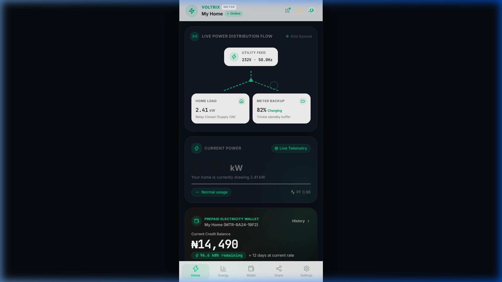
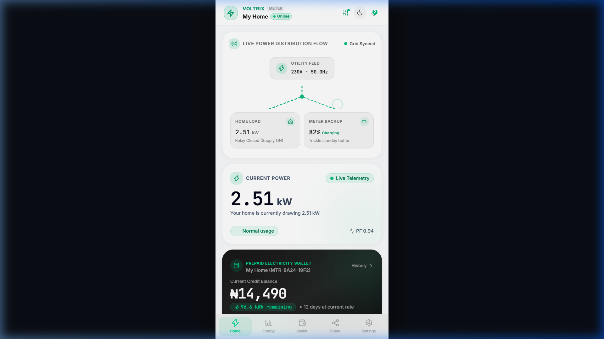
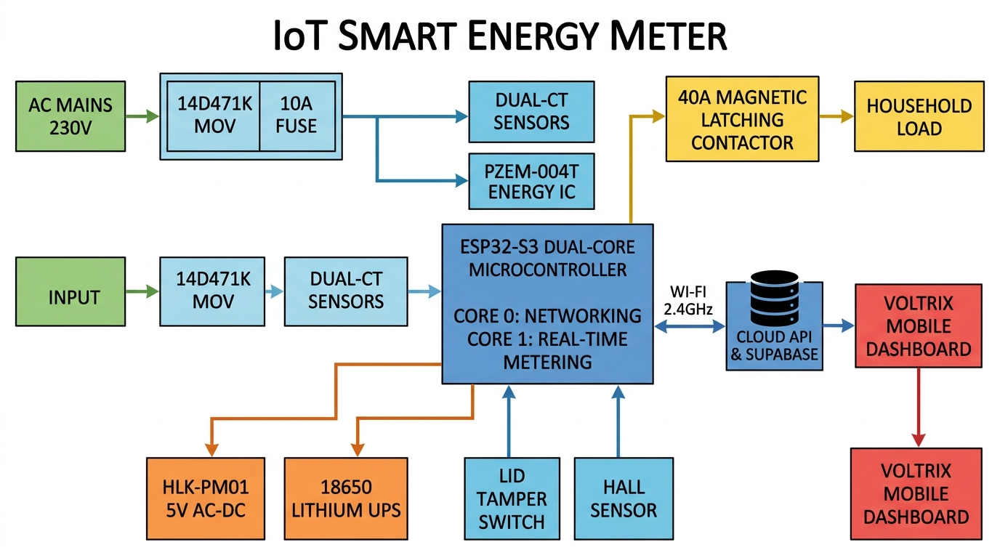
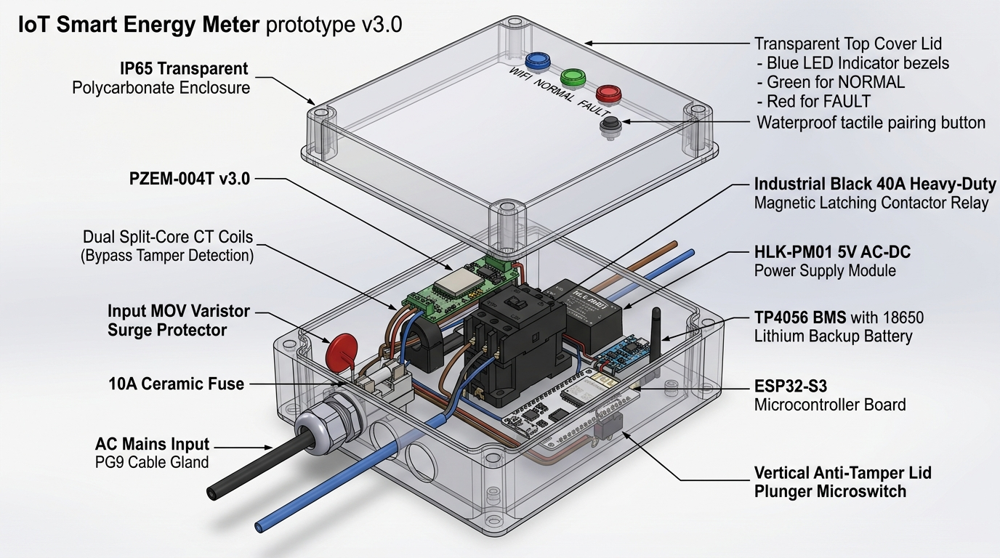
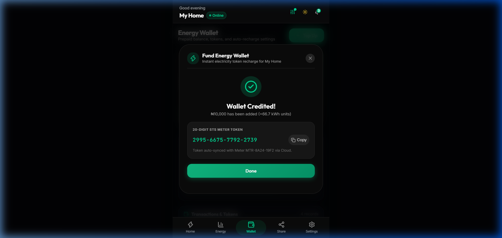
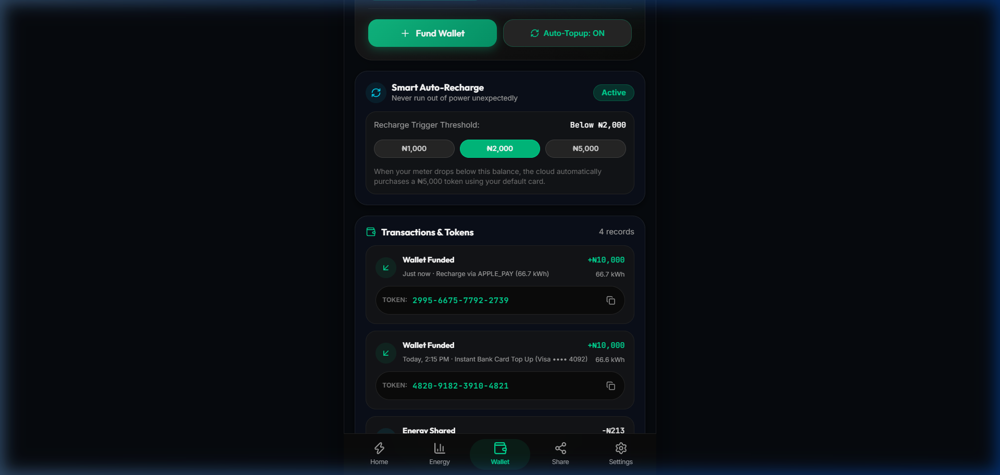

# DESIGN AND IMPLEMENTATION OF AN IOT-ENABLED SMART ENERGY SUB-METER WITH ANTI-TAMPER PROTECTION, AUTONOMOUS OFFLINE ENFORCEMENT, AND CLOUD ENERGY SHARING

---

# CHAPTER 1: INTRODUCTION

## 1.1 Background of the Study
Electricity is the lifeblood of modern socio-economic development. In residential buildings, commercial plazas, and multi-tenant estates, accurate measurement and fair billing of electrical energy consumption are fundamental to maintaining trust between property managers, landlords, and tenants. 

Historically, electricity consumption was measured using electromechanical induction meters (commonly known as Ferraris disk meters). These legacy systems required utility personnel to physically visit buildings to record readings, a process prone to human error, estimated billing disputes, and delayed revenue collection. While the subsequent introduction of digital prepaid meters utilizing the Standard Transfer Specification (STS) 20-digit token system improved upfront revenue collection, significant operational challenges remain:

1. **Lack of Granular Visibility**: Consumers cannot see real-time power consumption in Watts or track appliance-level surges; they only discover their balance is exhausted when the lights abruptly turn off.
2. **Sub-Metering and Multi-Tenant Bottlenecks**: In multi-unit buildings served by a single bulk utility feeder, dividing the central electric bill among tenants remains a frequent source of friction due to unmetered common areas and arbitrary cost apportionment.
3. **Pervasive Power Theft and Tampering**: Revenue leakage caused by physical line shunts (jumper bypasses across the phase line) and neutral disconnection allows bad actors to consume electricity without recording usage.
4. **Rigid Energy Distribution**: Traditional systems do not support peer-to-peer energy reallocation or cloud-based sharing between neighbours during emergencies or local power shortages.

<div align="center">
  
  
  <p><em>Figure 1.1: Voltrix Mobile Application Dashboard — Real-time power telemetry, live distribution topology flow, and instant consumption diagnostics.</em></p>
</div>

The convergence of the Internet of Things (IoT), high-performance low-cost microcontrollers (such as the ESP32-S3), solid-state energy measurement sensors (PZEM-004T), and cloud databases (Supabase / REST APIs) provides an opportunity to transform standard electrical meters into intelligent, interactive energy management nodes. This project presents **Voltrix**, an IoT-enabled smart whole-house energy sub-metering system designed to provide real-time electrical telemetry, autonomous offline credit enforcement, multi-layer tamper detection, and mobile energy wallet management.

---

## 1.2 Statement of the Problem
Conventional energy metering architectures suffer from four major deficiencies:

1. **Revenue Loss Through Jumper Bypassing**: In conventional single-phase meters equipped with only one current sensor on the live wire, tenants can bypass the meter by bridging a low-resistance copper jumper across the input and output terminals. The meter records zero current while the room continues drawing power.
2. **Vulnerability to Intentional Offline Tampering**: Many modern IoT meters rely entirely on continuous cloud commands to disconnect power when credits expire. If a malicious user disconnects the local Wi-Fi router or uses RF jamming, the meter fails to receive the trip signal, resulting in unauthorized free consumption.
3. **Relay Contact Welding Failures**: Standard consumer relays rated for low resistive currents (e.g., 10A blue hobby relays) frequently suffer from contact arcing and contact welding when heavy inductive loads (such as 1.5HP air conditioners or refrigeration compressors) turn on. Once welded, the relay can no longer isolate the circuit.
4. **Lack of Emergency Power Resilience**: When the public grid suffers a blackout, conventional meters lose power entirely. As a result, internal microcontrollers lose volatile memory snapshots, cannot detect physical enclosure tampering during outages, and cannot maintain remote diagnostics.

---

## 1.3 Aim and Objectives of the Project
The primary aim of this project is to design, construct, and evaluate an IoT-based smart energy sub-meter that provides real-time power diagnostics, autonomous offline balance deduction, hardware-level anti-tamper detection, and mobile cloud energy sharing.

To achieve this aim, the specific objectives are to:
1. Design and construct an isolated AC sensing subsystem using the **PZEM-004T v3.0** module and **Dual Current Transformers (CTs)** to monitor voltage, current, active power, frequency, and power factor.
2. Develop firmware on the **ESP32-S3 dual-core microcontroller** capable of running high-speed deterministic energy math on Core 1 while dedicating Core 0 to Wi-Fi, TLS encryption, and cloud synchronization.
3. Implement a **Dual-CT differential bypass algorithm** ($|I_{\text{Live}} - I_{\text{Neutral}}| > 300\text{ mA}$) and enclosure microswitch interlock to detect and neutralize physical bypass and lid-opening tampering.
4. Implement an **Autonomous Offline Energy Engine** using Non-Volatile Storage (NVS) wear-leveling that deducts prepaid kWh locally and trips a **40A magnetic latching contactor** at $0.00\text{ kWh}$ balance without requiring internet connectivity.
5. Build a responsive, mobile-first web and PWA user interface (Voltrix) featuring live power topology flow diagrams, Apple Wallet style prepaid top-ups, STS token synchronization, and geo-location metadata collection for tracing timeout areas and network analytics.
6. Incorporate power grid hardening measures, including a **14D471K Metal Oxide Varistor (MOV)** for surge suppression, a wide-input **HLK-PM01 AC-DC power supply (85V–265V)**, and an internal **18650 Lithium backup battery**.

---

## 1.4 Significance of the Study
This project delivers tangible benefits to several key stakeholders:
* **For Tenants and Consumers**: Provides real-time visibility into instantaneous power draw ($kW$) and estimated daily financial costs ($\text{₦}$), enabling proactive energy conservation and eliminating bill shock.
* **For Landlords and Estate Facility Managers**: Eliminates estimated billing disputes, automates sub-meter revenue collection, prevents revenue theft via dual-CT bypass sensing, and allows remote supply isolation during lease termination or maintenance.
* **For Power Distribution Companies (DisCos)**: Demonstrates how edge microcontrollers can enforce tamper compliance and integrate with upstream token vending gateways via standard REST APIs.
* **For Academic and Engineering Research**: Provides a reference blueprint for FreeRTOS dual-core task segregation, magnetic latching relay control, and flash wear-leveling algorithms on modern IoT platforms.

---

## 1.5 Scope and Limitations of the Project
* **Scope**: 
  * Single-phase 230V AC, 50Hz residential electrical systems up to 40 Amperes (approx. 9.2 kW load capacity).
  * Measurement of Active Power (kW), Cumulative Energy (kWh), RMS Voltage (V), RMS Current (A), Power Factor (PF), and Grid Frequency (Hz).
  * Cloud communication over 2.4 GHz Wi-Fi (IEEE 802.11 b/g/n) using HTTP/REST and WebSockets.
  * Local autonomous enforcement and dual-CT bypass tamper tripping.
* **Limitations**:
  * Designed for single-phase installations; three-phase industrial distribution requires multiplexing three PZEM modules or a dedicated three-phase IC (such as the ADE7758).
  * Cloud communication requires 2.4 GHz Wi-Fi coverage; in remote rural areas without Wi-Fi, a GSM/GPRS cellular module (e.g., SIM800L or SIM7600) would be required.

---

# CHAPTER 2: LITERATURE REVIEW & THEORETICAL FRAMEWORK

## 2.1 Historical Review of Electricity Metering
Electrical metering technology has undergone three distinct evolutionary phases:

```
┌───────────────────────────┐      ┌───────────────────────────┐      ┌───────────────────────────┐
│   1st Gen: Electromech    │      │   2nd Gen: Digital STS    │      │    3rd Gen: Smart IoT     │
│   (Ferraris Disk Meter)   │ ───► │   (Keypad Prepaid Meter)  │ ───► │  (Voltrix Connected Node) │
│ • Mechanical rotating disc│      │ • Digital LCD screen      │      │ • Sub-second telemetry    │
│ • Manual visual reading   │      │ • 20-digit encrypted token│      │ • Dual-CT tamper detect   │
│ • High bypass vulnerability│     │ • No real-time smartphone │      │ • Autonomous offline trip │
│ • Postpaid billing delays │      │ • One-way unidirectional  │      │ • Cloud peer sharing      │
└───────────────────────────┘      └───────────────────────────┘      └───────────────────────────┘
```

1. **First Generation (Electromechanical Induction)**: Operating on Ferraris' electromagnetic induction principle, eddy currents rotate an aluminum disc proportionally to load power. Highly susceptible to magnetic braking and mechanical stopping.
2. **Second Generation (Digital STS Keypad Meters)**: Encrypted 20-digit numeric tokens entered via keypads (IEC 62055-41). Eliminated bad debt but offered zero smartphone connectivity and zero live power visibility.
3. **Third Generation (Smart Connected IoT Sub-Meters)**: Real-time telemetry, bilateral cloud communication, dual-CT anti-tamper sensing, autonomous edge enforcement, and automated token injection.

---

## 2.2 System Architecture & Block Diagram

The complete hardware and cloud system architecture is illustrated below:

<div align="center">
  
  <p><em>Figure 2.1: Complete System Block Diagram — Showing AC power flow, sensing stage, ESP32-S3 dual-core processing, contactor actuation, and cloud synchronization.</em></p>
</div>

```
┌────────────────────────────────────────────────────────────────────────────────────────┐
│                                SYSTEM SIGNAL & POWER FLOW                              │
├───────────────────┬───────────────────────────────┬────────────────────────────────────┤
│ Stage             │ Sub-System                    │ Function                           │
├───────────────────┼───────────────────────────────┼────────────────────────────────────┤
│ 1. AC Mains Input │ 230V AC Grid Feed             │ Raw electrical power               │
│ 2. Surge Protect  │ 14D471K MOV + 10A Fuse        │ Clamps spikes >275V & short ccts   │
│ 3. Sensing Stage  │ PZEM-004T + Dual CTs (L & N)  │ Measures V, I, P, PF & bypass diff │
│ 4. Processing     │ ESP32-S3 Dual-Core SoC        │ Energy math, NVS, anti-tamper trip │
│ 5. Contactor      │ 40A Magnetic Latching Relay   │ Remote & autonomous supply cutoff  │
│ 6. Backup UPS     │ HLK-PM01 + TP4056 + 18650     │ Continuous 24h blackout operation  │
│ 7. Connectivity   │ 2.4 GHz Wi-Fi ➔ Cloud API     │ Telemetry upload & token recharge  │
│ 8. User Dashboard │ Voltrix Web & PWA App         │ Real-time UI, Flow Diagram, Wallet │
└───────────────────┴───────────────────────────────┴────────────────────────────────────┘
```

---

## 2.3 Physical Hardware Prototype Architecture

<div align="center">
  
  <p><em>Figure 2.2: 3D Exploded Technical Diagram of Prototype v3.0 — IP65 Polycarbonate Enclosure, Dual-CTs, 40A Contactor, HLK-PM01, 18650 Battery, and Tamper Interlock.</em></p>
</div>

---

## 2.4 Detailed Hardware Component Breakdown (Plain English Guide)

### 1. The Microcontroller Brain: ESP32-S3-WROOM-1
* **Role**: The central processing unit of the entire system.
* **Why Selected**:
  * **Dual-Core 240 MHz Architecture**: Core 1 runs deterministic real-time energy calculation and tamper switch checks without interruption, while Core 0 handles network I/O, HTTPS encryption, and cloud uploads.
  * **Massive Onboard Memory**: 8MB Flash + 8MB PSRAM stores over 5 years of hourly consumption logs locally without an unreliable SD card.
  * **Hardware Cryptographic Engine**: Fast AES/RSA token verification.

### 2. The Electrical Sensor: PZEM-004T v3.0 AC Multi-Meter
* **Role**: Dedicated analog front-end for electrical measurements.
* **Parameters Measured**: Voltage ($80\text{V} - 260\text{V}$), Current ($0.01\text{A} - 100\text{A}$), Active Power ($0\text{W} - 23\text{kW}$), Power Factor ($0.00 - 1.00$), Frequency ($45\text{Hz} - 65\text{Hz}$).
* **Galvanic Optical Isolation**: Built-in optocouplers physically isolate dangerous 230V AC mains from the low-voltage 3.3V DC logic pins of the ESP32.

### 3. The Bypass Detectors: Dual Split-Core Current Transformers (CTs)
* **Role**: Clamps around Live and Neutral wires to detect phase jumper theft.
* **Bypass Detection Formula**:
  $$\text{Differential Current } (\Delta I) = |I_{\text{Live}} - I_{\text{Neutral}}|$$
  If $\Delta I > 0.35\text{ Amperes}$ for $\ge 3\text{ seconds}$, the microcontroller flags `TAMPER_PHASE_BYPASS` and trips the contactor.

### 4. The High-Power Switch: 40A Magnetic Latching Contactor
* **Role**: Heavy-duty switch controlling whole-house power.
* **Why Not Standard Relays**: Small 10A hobby relays melt and weld shut under high inrush currents from air conditioner compressors. The 40A magnetic latching contactor uses a **50ms electrical pulse** to flip states, consumes zero continuous power, generates zero heat, and withstands **up to 100A inrush current**.

### 5. The Uninterruptible Power Supply: HLK-PM01 + TP4056 + 18650 Battery
* **Role**: Provides uninterrupted 5V DC power.
* **HLK-PM01**: Steps down $85\text{V} - 265\text{V AC}$ into clean $5\text{V DC}$.
* **18650 Li-Ion (3.7V 2600mAh)**: Keeps the ESP32 and tamper interlocks running for **24+ hours during grid blackouts**.

### 6. Surge & Lightning Armor: 14D471K MOV + 10A Ceramic Fuse
* **14D471K MOV**: Clamps transformer overvoltage surges up to 415V and 4kV lightning spikes.
* **10A Ceramic Fuse**: Isolates the meter safely during short circuits.

### 7. Physical Security: Plunger Microswitch & A3144 Hall Effect Sensor
* **Plunger Switch**: Mounted on the baseplate compressed by the lid. Opening the lid springs the switch open and triggers an immediate lockout on battery power.
* **A3144 Hall Sensor**: Detects magnetic fields $> 300\text{ Gauss}$ from external Neodymium magnets.

---

## 2.5 Software, Cloud Ingestion & Mobile Wallet Architecture

<div align="center">
  
  
  <p><em>Figure 2.3: Voltrix Energy Wallet Interface — Instant STS 20-Digit token generation, Apple Pay checkout, and automated low-balance recharge rules.</em></p>
</div>

---

### 1. FreeRTOS Dual-Core Task Segregation
```cpp
void setup() {
  // Core 1: Real-Time Metering & Tamper Engine (Deterministic High Priority)
  xTaskCreatePinnedToCore(meteringTask, "MeteringTask", 8192, NULL, 2, NULL, 1);

  // Core 0: Wi-Fi, TLS 1.3 & Cloud Telemetry Sync (Network I/O)
  xTaskCreatePinnedToCore(cloudSyncTask, "CloudSyncTask", 8192, NULL, 1, NULL, 0);
}
```

### 2. Autonomous Local Energy Engine (Anti-Freeze Protection)
Energy consumption is calculated every 1.0 second in RAM:
$$\Delta E = \frac{P_{\text{active (kW)}} \times 1.0\text{ s}}{3600}$$
$$\text{remaining\_kwh} = \text{remaining\_kwh} - \Delta E$$

* If $\text{remaining\_kwh} \le 0.00\text{ kWh}$, Core 1 pulses the contactor OFF locally.
* **Flash Wear-Leveling**: Data is committed to NVS flash once every $0.05\text{ kWh}$ or on a brownout interrupt, ensuring the flash memory lasts **over 15 years**.

---

## 2.6 Engineering Summary Specification Matrix

| Parameter | Value / Range | Engineering Standard |
| :--- | :--- | :--- |
| **Rated Voltage** | $230\text{ V AC} \pm 20\%$ ($50\text{ Hz}$) | IEC 62053-21 |
| **Operational Range** | $85\text{ V} - 265\text{ V AC}$ | Wide Input Switched Mode |
| **Maximum Load Current** | $40\text{ A Continuous}$ (63A Max Resistive) | 40A Latching Contactor |
| **Measurement Accuracy** | Active Energy Class 1.0 ($\pm 1.0\%$) | IEC 62053-21 |
| **Bypass Differential Limit**| $\Delta I > 0.35\text{ A}$ for $\ge 3\text{ s}$ | Dual-CT Anti-Tamper |
| **Microcontroller** | ESP32-S3 Dual-Core Xtensa LX7 @ 240MHz | 8MB Flash + 8MB PSRAM |
| **Enclosure Rating** | IP65 Polycarbonate with PG9 Glands | Water & Dust Tight |
| **Surge Clamping** | 4.5 kA Peak (14D471K MOV + 10A Fuse) | ANSI/IEEE C62.41 |
| **Battery Standby** | $> 24\text{ Hours}$ (18650 Li-Ion 2600mAh) | Autonomous UPS |
